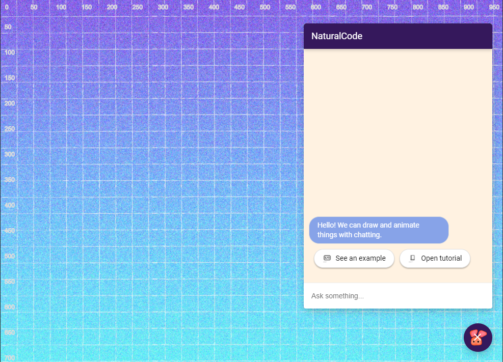
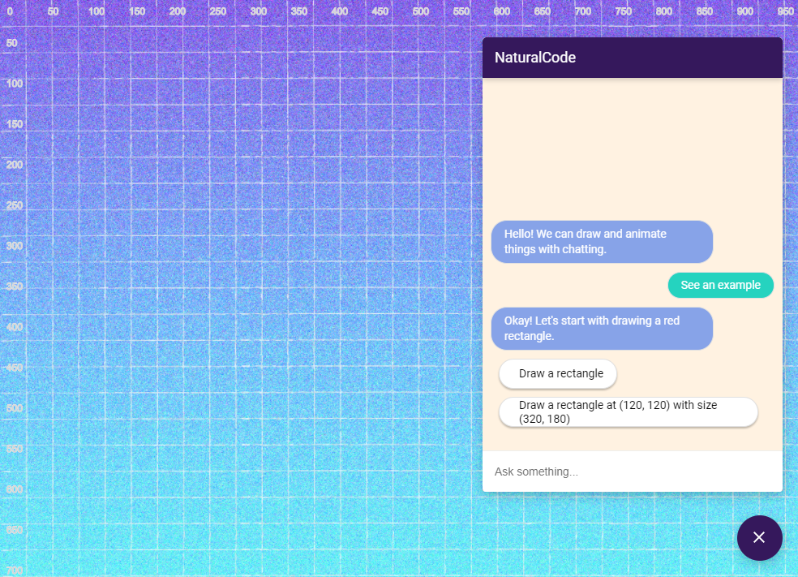
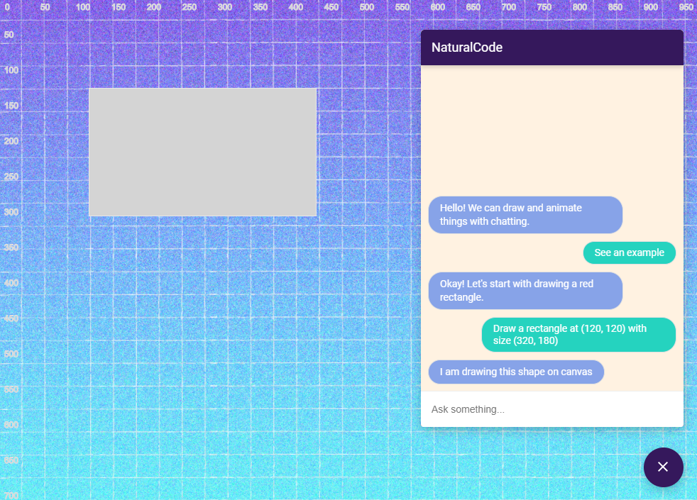

# CodeFlow Programming
---

⚡⚡⚡ This README is just a quick-start for the environment, please read our [CODELAB](https://asabuncuoglu13.github.io/codeflow/#0) if you want to explore the project! Also, check the project from [Repl.it](https://repl.it/@pokingaround/codeflow)

---
We developed this language (_... or better to say a programming environment or a test platform for natural algorithmic conversation_) to experiment with the chatbots and natural language to create an algorithmic conversation experience. When you run the repl.it repo, you will see a screen like a figure below. We included pixel values similar to a ruler on the screen to better plan your code.




You can draw and animate things on the screen. The system is powered by [p5.js](https://p5js.org), a Javascript client-side library for creating graphic and interactive experiences, based on the core principles of Processing. Let’s see one example to understand the experience better. 



To draw a rectangle on the canvas, you can simply say “Draw a rectangle”, “Draw a rect”, “rect”, “rectangle”, “Draw a rectangle at 100, 100”, “Rect at 120, 200, with size 300, 400”... These commands will all draw some rectangles at different positions with different size.



When the system processes your command, the result will automatically appear on the canvas. 

## Technical Specifications

```
Requirements:
🖥️ Repl.it
🖥️ Python3.8 ~ Flask1.0.2
🖥️ Dialogflow (If you want to contribute, I can add you to the project)
🖥️ Javascript Libraries ~ p5.js, highlight.js, fuse.js, jquery
```

We used repl.it for easy prototyping, hosting the web server, and let others to easily fork and remix the application. 

Flask is required to handle the webhook calls coming from the Dialogflow and generate unique responses for changing parameters. 

We prototyped the chatbot with Dialogflow. It is easy to use and fast to integrate with different development environments. Although the platform is designed to answer the most popular use case scenarios for business applications, our experiment revealed some interesting use cases and possible development needs, if we want to achieve a more humanly experience.

We wanted to design this environment as accessible as possible, so, to run the application on every device, we wanted to develop a web application. We used _p5.js_ to create graphics on canvas, _highlight.js_ to show the resulted Javascript code in a readable-format, _fuse.js_ to correct the code if some letters are not correctly typed to the chatbot,  _jquery_ to handle UI operations.

## Contribution

The project is an experiment on designing more human-friendly programming environments. It is an active project and open for contribution!